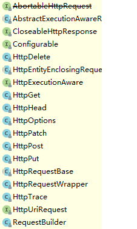
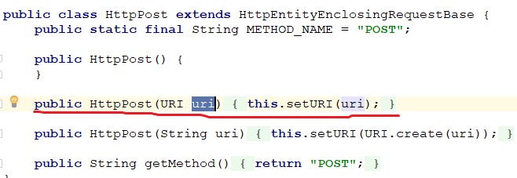
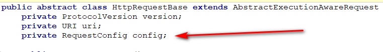
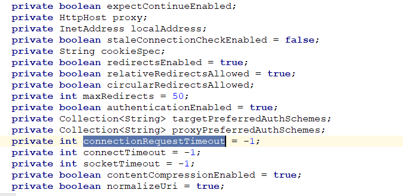
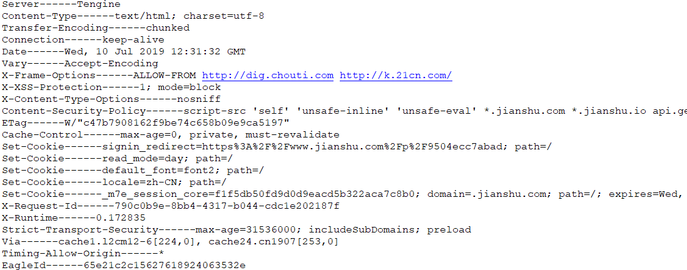

# HttpClient 
## HttpClient是什么
HttpClient 是Apache Jakarta Common 下的子项目，可以用来提供高效的、最新的、功能丰富的支持 HTTP 协议的客户端编程工具包，并且它支持 HTTP 协议最新的版本和建议。

## HttpClient可以做什么
* 实现所有的http请求(get、post、put、delete、head、options)
* 实现Https协议
* 支持代理服务器（nginx）
* 支持自动跳转

### http请求
编号|方法|描述
:--|:--|:--
1|GET|请求页面并返回一个实体（html页面代码）（带参显示）
2|POST|向指定资源提交数据（表单，文件），数据被包含在请求头里，意味着新的资源的创建和修改。（不显示携带的参数）
3|HEAD|类似于GET方式，只是它只获取报头
4|PUT|从客户端向服务器传送的数据取代指定的文档的内容。
5	|DELETE|	请求服务器删除指定的页面。
6	|CONNECT|	HTTP/1.1 协议中预留给能够将连接改为管道方式的代理服务器。
7	|OPTIONS|	允许客户端查看服务器的性能。
8	|TRACE|	回显服务器收到的请求，主要用于测试或诊断。
9	|PATCH|	是对 PUT 方法的补充，用来对已知资源进行局部更新 。

### http请求头
方法|描述
:--|:--
Accept|请求方式 
Accept-Chareset|请求支持的字符集编码
Accept-Encoding|请求支持的压缩格式
Accept-Language|请求的语言
Host|请求的主机地址

### Http状态码
状态码|描述
:--|:--
1**|	信息，服务器收到请求，需要请求者继续执行操作
2**	|成功，操作被成功接收并处理
3**	|重定向，需要进一步的操作以完成请求
4**|	客户端错误，请求包含语法错误或无法完成请求
5**	|服务器错误，服务器在处理请求的过程中发生了错误

## 怎么做

### 导入jar包
```
<dependency>
        <groupId>org.apache.httpcomponents</groupId>
        <artifactId>httpclient</artifactId>
</dependency>
```

### 构建HttpClient
```     
//方式一
        CloseableHttpClient closeableHttpClient1 = HttpClients.createDefault();
        //方式二
        CloseableHttpClient closeableHttpClient = HttpClientBuilder.create().build();
```


### 设置请求路径和方式

```
String url="";//按实际需求选择方式

HttpGet httpGet = new HttpGet(s);

HttpPost post=new HttpPost(s);

HttpDelete delete=new HttpDelete(s);
```


支持两种url方式
一种是字符串，一种是URI


## 设置请求头
HttpGet、HttpPost等继承其父类的HttpRequestBase的方法中有一个父类属性：


在RequestConfig类中有一个封装好的静态内部类Builder，它封装了很多常用的初始值，你可以根据需要改需要改的就可以了。


```
RequestConfig requestConfig = RequestConfig.custom()
					// 设置连接超时时间(单位毫秒)
					.setConnectTimeout(5000)
					// 设置请求超时时间(单位毫秒)
					.setConnectionRequestTimeout(5000)
					// socket读写超时时间(单位毫秒)
					.setSocketTimeout(5000)
					// 设置是否允许重定向(默认为true)
					.setRedirectsEnabled(true).build();
  httpGet.setConfig(requestConfig);                  
```

## 发送请求并接受响应内容
```
CloseableHttpResponse  response=closeableHttpClient.execute(httpGet);
```
### 获取响应信息
>获取协议版本
```
response.getProtocolVersion()
```

>获取header信息response.getAllHeaders()
```
//尝试打印出来
Arrays.stream(response.getAllHeaders()).forEach(n-> System.out.println(n.getName()+"---"+n.getValue()));
```
;

>获取实体
```
HttpEntity responseEntity = response.getEntity();
```
## 关闭连接和响应

```
closeableHttpClient.close();
response.close();
```


# 完整代码

```
 String s = "https://www.jianshu.com/p/9504ecc7abad";
        //方式一
        //CloseableHttpClient closeableHttpClient1 = HttpClients.createDefault();
        //方式二
        CloseableHttpClient closeableHttpClient = HttpClientBuilder.create().build();


        HttpGet httpGet = new HttpGet(s);

        RequestConfig requestConfig=RequestConfig.custom().build();
        HttpPost post=new HttpPost(s);
        HttpDelete delete=new HttpDelete();
        CloseableHttpResponse response = null;
        try {
            response = closeableHttpClient.execute(httpGet);
            //Arrays.stream(response.getAllHeaders()).forEach(n-> System.out.println(n.getName()+"------"+n.getValue()));
            HttpEntity responseEntity = response.getEntity();
            if(responseEntity!=null){
                
                System.out.println(EntityUtils.toString(responseEntity));
             }
        } catch (IOException e) {
            e.printStackTrace();
        }
        finally {
            try {
                closeableHttpClient.close();
                response.close();
            } catch (IOException e) {
                e.printStackTrace();
            }

        }
```