# sql基础语句

## select语句
`SELECT * | {[DISTINCT] column|expression [alias],...}
FROM	table;`
* SELECT 表示要取哪些列
* FROM 表示要从哪些表中取


```
SELECT *FROM employees; ---获取全部列
SELECT last_name, salary, salary + 300	FROM employees; ---选取一部分
```
> ### 给列取别名(AS|"")

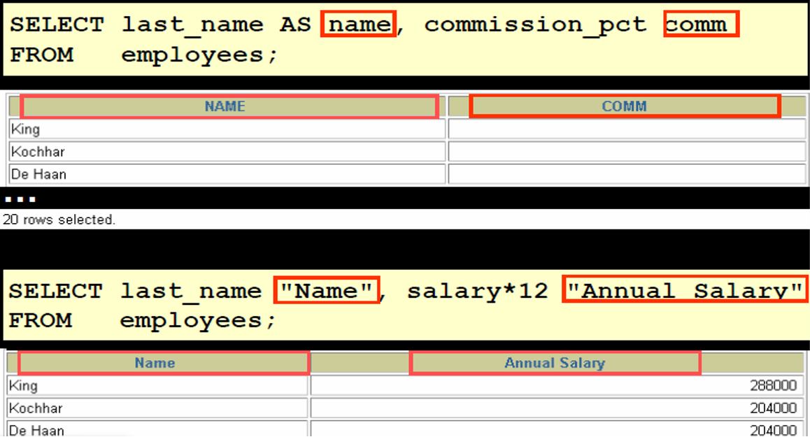


>### NULL

NULL表示 不可用、未赋值、不知道、不适用 ， 它既不是0 也不是空格。

**记住：一个数值与NULL进行四则运算，其结果是？ NULL**

>### 符串连接操作符： “||”

```
select first_name || last_name || '来自成都' from employees ---拼接字符串

select first-name || last_name from employees; ---拼接列
```


>### distinct ---去重

SELECT  name FROM mytable;

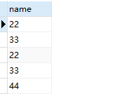

SELECT DISTINCT name FROM mytable;

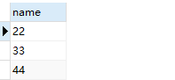

## 一般不在循环中执行sql语句，最好在sql中写

## 查询条件与排序

> ### where 

```
select * from mytable where id=2 
```
>### 比较操作

|比较操作符|意义|
|:--|:--|
=|等于
`>`|大于
`>=`|	大于等于
`<`	|小于
`<=`|	小于等于
`<>`|	不等于
`BETWEEN ...AND...`	|在两个值之间
`IN(set)`	|在一个集合范围内
`LIKE`	|匹配一个字符串样子，可以使用%通配符
`IS NULL`	|是一个空值，注意不能使用 =NULL

---
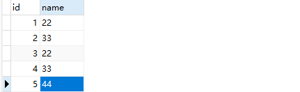

----
>> =

`SELECT *  FROM mytable WHERE id=1`

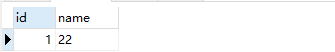

>> `>`

`SELECT *  FROM mytable WHERE id>1`

>> `>=`

`SELECT *  FROM mytable WHERE id>=1`

>> `<=`

`SELECT *  FROM mytable WHERE id<=3`

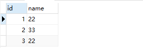

>> `<>`

`SELECT *  FROM mytable WHERE id<>3`

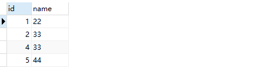

>> BETWEEN  and

`SELECT *  FROM mytable WHERE id BETWEEN 2 and 4;`

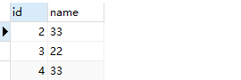

>> like 

`SELECT *  FROM mytable WHERE name like '_3%'`

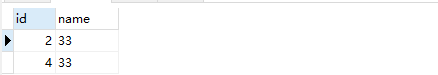

>ORDER BY --默认升序排序

`SELECT *  FROM mytable ORDER BY id desc;`

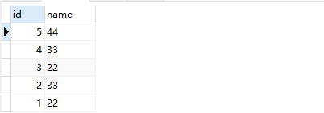


# DML语句（数据操作语句） 

## insert --插入数据
---
### insert四种方式：
* 方式一：表名+列名
```
INSERT INTO table [(column [, column...])]
VALUES	(value [, value...]);

insert into mytable(id,name)
values(6,'adas');
```
* 方式二：只写表名
```
INSERT INTO table
VALUES	(value [, value...]);

insert into mytable
values(6,'adas');
```

* 方式三：从另一个表中 Copy 一行

```
INSERT INTO table [(column [, column...])]
subquery;

insert into mytb(id,name) SELECT id,name from mytable where id>3
```
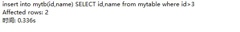

```
SELECT * from mytb
```

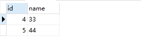

* 方式四：子查询插入 ---mysql中语句运行未成功 可以试试oracle--

```
insert into(
SELECT id,name from mytb where id=3
)values(1,'aa');
```
## update --修改数据
---
### 更新一列数据
```
update mytb set name='sda' where id=1
```

### 使用子查询的结果作为更新后的值
```
update mytbs set name=(select name from mytable where id=4) where id=5

```
>**mysql不允许子查询的表和更新的表是同一张表**
>**注意约束**

## delete --删除数据
---
### 删除一条数据
```
delete from mytbs where id=1
```
### 删除全部数据
```
delete from mytbs
```

>**注意约束**